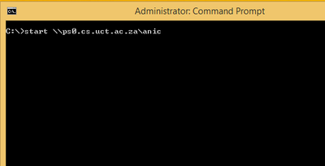
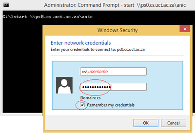
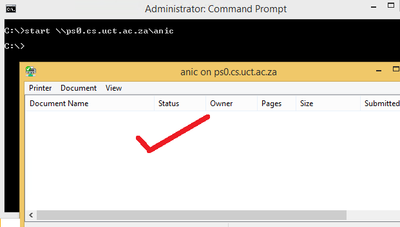

Printing in the Grad Labs
=========================

The Graduate Labs include Room 300 and the ICT4D Lab (Room 3A.1).

.. warning:: Please be mindful of the amount you print as you will be
asked to justify excessive printing.

For assistance, please contact the :ref:`sysadmins-label` at
help@cs.uct.ac.za.

Requirements
------------

To use this printing service you need:

* :ref:`cs_windows_credentials`
* Membership of the grads group

Printers
--------

There are two printers available:

.. csv-table::
   :escape: \
   :header: "Location", "Printer", "Windows Path", "Linux Path"

   "Room 300", "anic", "``\\\\ps0.cs.uct.ac.za\\anic``", "``smb://ps0.cs.uct.ac.za/anic``"
   "ICT4D", "charcoal", "``\\\\ps0.cs.uct.ac.za\\charcoal``", "``smb://ps0.cs.uct.ac.za/charcoal``"

Operating System
----------------

Follow the instructions for setting up printing on your operating system.

Linux/Unix
++++++++++

These instructions have been tested on the Ubuntu linux distribution.
They should work for other versions of Ubuntu without much change. 

They should also work for other distributions of linux or unix (such as
MacOS X) which use of the CUPS printing system, though the configuration
utilities may differ and you may need to do your own detective work to
figure out where to enter the configuration options in the instructions
below.

.. note:: You will need sudo / root privileges on the workstation to be
able to install and configure the printer.

Instructions
::::::::::::

These instructions have been written for Ubuntu.

#) Log into the graphical user interface (GUI)  as a user with sudo
privileges.

#) Open the Settings app. Select Printers > Add...

#) Click "Add" to add a new printer. The "New Printer" dialog should
appear.

#) In the Enter URI field, enter the Linux URL from the table above.
   
#) Click the Verify button to test this configuration. If you entered
the above information correctly, you should see a Print Share Verified
dialog box. Click the OK button to continue.

#) Click the "Forward" button to continue to the next step of the the
printer configuration.

   A "Searching for drivers" dialog should appear. Please wait while the
   system collects information about available print servers on your
   system. This may take a few minutes. The dialog should eventually
   disappear.

#) The "Choose Driver" dialog should appear. Click "Select printer from
database" and select "HP" from the list of printer Makes provides. Click
the "Forward" button to continue with the next stage of the printer
configuration.

#) A list of printer Models will be displayed. Search for and select
"LaserJet P3005" from the list on the left. Make sure that "HP LaserJet
P3005 Postscript [en] (recommended)" is selected from the list of
drivers on the right when this option is selected. Click the "Forward"
button to continue with the printer configuration.

#) The "Installable Options" dialog will appear. Make sure that you set
the available options as follows to ensure that you are able to make use
of the features of this printer::

    Change "Tray 3" from "Not Installed" to "Installed"
    Leave "Collation in Printer" as "No: Total RAM < 80MB and No Hard Disk"
    Leave "Printer Disk" as "No Installed"
    Make sure that the Duplex Unix option is selected.
    Leave "Fit to Page" as "Prompt User"

#) Click the "Forward "button to continue with the configuration.

#) The "Describe Printer" dialog will appear. Fill in the field provided
as below::

    Change "Printer Name" to "anic-via-ps0"
    Change "Description" to "HP LaserJet p3005x"
    Change "Location" to "Grad Lab"

#) Click the "Apply" button to complete the printer configuration.

   If prompted to print a test page, click the No button.

Your computer should now be configured to print to printing system.

Printing
::::::::

To print from most GUI applications, click the applications Print option
and select the printer you defined above ("anic-via-ps0") from the list
of available printers. 

The printer should prompt you for a username and password to
authenticate your print job. Enter your :ref:`cs_windows_credentials`.
If authentication succeeds, your print job should automatically be
forwarded for your local print service to the print service on the
``PS0`` print server where it will be counted before being sent to the
printer to be printed.

To print from the command-line using the lpr command as usual e.g.::

        lpr -Panic-via-ps0 file.ps

The print job will be placed in the print queue on your workstation, and
held until you authenticate it. To authenticate it, click System >
Administration > Printing. The Printing window listing all of the
available printers will be displayed. Right click on the the printer
"anic-via-ps0" and select "View print queue" from the menu. A list of
print jobs will appear. Right click on the print job and select
Authenticate from the menu to authenticate and print the print job.

Windows
+++++++

Please email the :ref:`sysadmins-label` at help@cs.uct.ac.za if
assistance is required.

.. note:: You will need administrative privileges on the workstation to
be able to install and configure the printer.

Instructions
::::::::::::

Open a Command Prompt window, eg. Window Key + R > then type CMD in the
Open dialog field.

In the Command Prompt window, type ``start \\ps0.cs.uct.ac.za\<printer
name>``, eg. ``start \\ps0.cs.uct.ac.za\anic``

Type in your Microsoft Windows credentials in the ensuing authentication
dialog, eg. cs\<username> and password

The installation will proceed with the automatic installation of the
printer driver and the presentation of the connected printer

Printing
::::::::

#) Open any document, click on Print

#) Select the printer from the drop-down list, eg. anic

#) Print jobs will be submitted with the preset printer defaults, viz.
duplex (double sided), economy (saves on toner)

MacOS
+++++

This section is still to be written.
